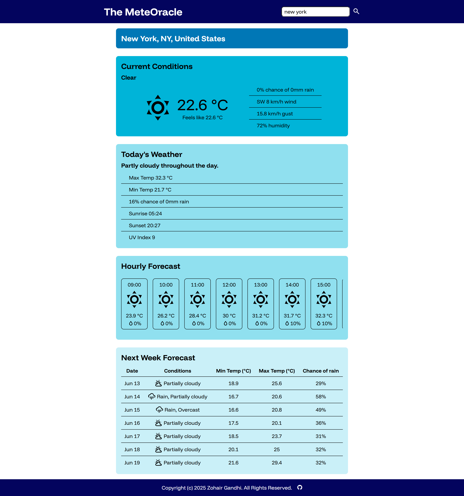

# Weather App: The MeteOracle

## Description

Weather application designed to provide comprehensive weather information for
any user-specified location. Uses the Visual Crossing Weather API to fetch and
display current conditions, daily forecast overview, hourly weather details, and
7-day extended forecast.



## Live Demo

Access the deployed application directly via GitHub Pages:

[https://zohairgandhi.github.io/weather-app/](https://zohairgandhi.github.io/weather-app/)

## Technologies Used

- HTML: For application structure
- CSS: For styling
- JavaScript: For core application logic, API interaction, and dynamic content
  updates
- Webpack: Used to bundle application assets, optimizing performance
- date-fns: Used for date manipulation and formatting

## Installation and Local Setup

If you wish to run the app locally, follow these steps:

1. Begin by cloning the project to your local machine using Git:

```bash
git clone https://github.com/ZohairGandhi/weather-app.git
cd weather-app
```

2. Install all necessary dependencies:

```bash
npm install
```

3. Once dependencies are installed, start the local development server:

```bash
npm run start
```

This command will typically launch the application in your default web browser
at an address like `http://localhost:8080`
